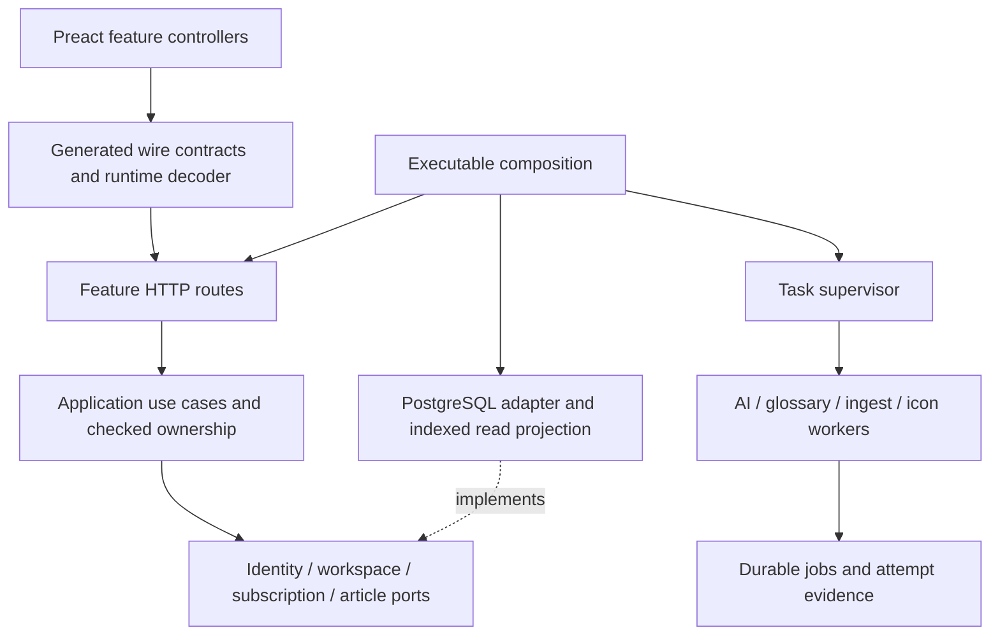

# Architecture changes, 2026-09-27

The system remains a Rust/PostgreSQL/Preact modular monolith. No extra service,
broker or runtime is required.

- Session lifetime owns ReaderApplication. Reader and workspace controllers own
  request generations, synchronous activation locks and optimistic state. A late
  read or rollback can only change the generation that issued it.
- Identity, workspace, subscription, article, rule and operational persistence
  have separate ports. ReaderRepository composes them only at the application
  boundary. HTTP feature modules map commands/DTOs; article mutation resolves an
  unforgeable OwnedWorkspace before reading or writing article state.
- reader-runtime owns task supervision and correlation, independent of product
  features. SIGINT/SIGTERM close admission and wake idle loops; active work drains
  within configured grace. AI classes share a FIFO semaphore, preserving the
  configured global concurrency instead of multiplying provider traffic.
- Rust wire schemas generate checked-in frontend contracts. Generation is explicit;
  normal builds consume artifacts. The release gate rejects schema drift. Critical
  network responses are checked without coercion before reaching UI state.
- PostgreSQL generated columns are a rebuildable read projection over exact TEXT
  documents. State predicates and ordering do not repeatedly parse article JSON.
  Arrival order uses an exact numeric calendar key including nanoseconds, preserving source precision. An
  additive schema upgrade is necessary here to preserve the existing database;
  no old execution path or dual writer is retained. Invalid indexed timestamps
  abort the transaction; they are never silently narrowed or rewritten.
- New translation attempts freeze the entire validated provider body, limits and
  validator identity. Historical attempts without this evidence remain visible;
  they are not executed using a substituted current prompt. Cache lookup compares
  exact input identity and source revision. Raw bounded provider replies survive
  validation failure. Offline replay uses `cargo run -p reader-ai --bin
  replay_translation -- audit-envelope.json` (`source` and `reply` fields); it has
  no key or HTTP dependency at execution time and never publishes changes itself.
- FloatingPanel, ModalDialog, StatusRegion and AsyncButton share interaction
  mechanics. CSS tokens have one owner and a reference-integrity test. Source
  formatting is maintained by pinned Prettier; generated files are excluded.
- The PostgreSQL acceptance fixture now starts the real Rust router and embedded
  UI, invokes Playwright, verifies committed data, and checks another account is
  unchanged. It runs under the normal cargo release test command, with no skips.
- HTTP returns a locally generated X-Request-ID. Correlation follows task-local
  context through SQLx and outbound logs. Typed operation IDs connect submission
  and durable work. Stage names are a closed enum; payloads, credentials, URLs and
  account names are not metric labels. Provider and validation durations are
  separate from queue wait.

Verification results and rollout evidence are recorded in the task ledger.

## Ownership and dependency direction

The server contract exporter stays independent of core/application/storage.
AI and glossary own their wire models; their optional `schema` features enable
explicit generation, and are not needed by the production build. UI drafts remain
separate types because incomplete form state is not an executable server command.

## Evidence and limits

The SQL benchmark is synthetic and measures individual read queries, with both
old and new indexes present and one warmup plus three measured samples. It does
not measure network latency, mixed production workloads or write throughput.
Generated projections add storage and index maintenance; they deliberately avoid
a second writable copy of article state. No claim of a universal throughput gain
is made. Backup restoration and exact-document tests cover preservation, including
nanoseconds, leap seconds and signed years.

Offline translation replay checks the retained response against the current
supported validator. An unknown persisted validator identity fails before a paid
request. Historical attempts without frozen input are readable but not silently
re-executed with today's prompt. AI factual quality remains a separate evaluation
problem; architectural validity is not evidence of factual correctness.

### Read-query measurements

Run `python3 tools/benchmark_reader_queries.py` with Docker. The fixture uses a
pinned PostgreSQL 17 image and temporary RAM storage; original and projected
indexes coexist. The run used the amd64 image on an arm64 Docker host, so absolute
times are not a production SLO. Complete SQL, plans and samples are in
`query-benchmark-2026-09-27.json`.

| Articles | Previous page, ms | Projected page, ms | Previous unread count, ms | Projected unread count, ms |
|---:|---:|---:|---:|---:|
| 10,000 | 5.459 | 2.230 | 169.398 | 10.387 |
| 100,000 | 5.361 | 2.199 | 636.554 | 73.354 |
| 1,000,000 | 5.350 | 2.076 | 6535.725 | 702.365 |

The API also reuses the Feed total as its unread total, avoiding a duplicate
COUNT. State predicates remain literal SQL chosen from a closed match so a
prepared statement's generic plan can still use partial indexes.

Production follow-up found an additional independent cost: the subscription
statistics query grouped repeated article rows together with full icon data URLs,
source and health documents. Counts now aggregate subscription/article identities
first, then join metadata once. Read-only comparison on production confirmed exact
result equality. After one warmup, three samples gave medians of **917.564 ms before
and 35.916 ms after**. A PostgreSQL plan regression rejects grouping on document or
icon payloads. This measurement is recorded in
`subscription-stats-benchmark-2026-09-27.json`.
